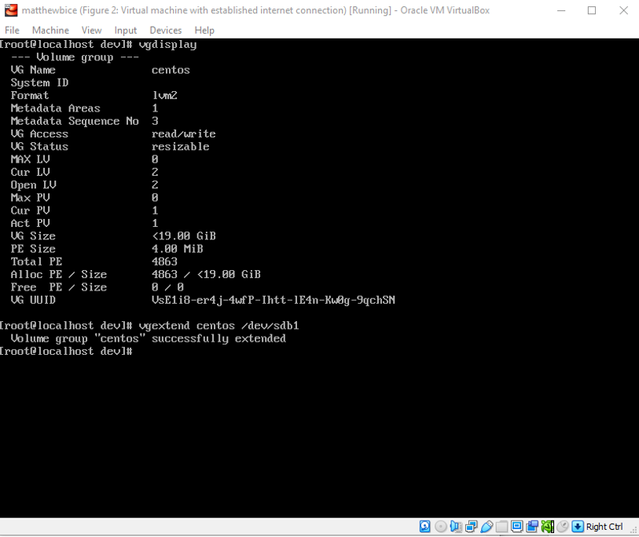
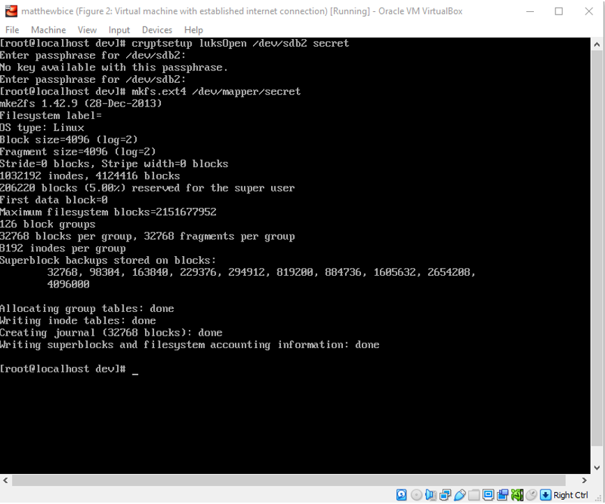

# Introduction

Usually, when a computer runs out of space, the logical next step is to either swap the full hard drive for an empty one or introduce a new hard drive. From there, it is only a matter of mounting it onto the machine and the user is good to go. However, in some cases, there are some additional criteria that must be taken into account such as how many partitions must be made, and how much space must be allocated to the first hard drive. Moreover, with this information in place, there is also the concern of security. This lab will be addressing these points by demonstrating the introduction and allocation of a new hard drive and the encryption of a hard drive’s partition.

# Extend/Reduce Logical Volumes in CentOS

## Creating the New Hard Drive

The lab instructions propose a scenario in which the root volume of my system is running out of space. In turn, I go out and purchase a new hard drive that I can plug in along with the pre-existing one so that I do not lose any of my previously saved data. Of course, I am working on a virtual machine rather than an actual computer so I will not be working with a real, physical hard drive. Instead, I can create a new one within VirtualBox and implement it onto my CentOS machine. To do so, I access the “settings” panel in VirtualBox and navigate to the “storage” section. From there, I click the “add” icon and open the hard drive creation window. For the type of hard disk, I select VDI for “VirtualBox Disk Image.” The software’s official website states that this type of hard disk is VirtualBox’s “own container format for guest hard disks” and that it “is used when [creating] a new virtual machine with a new disk. In this case, the virtual machine has been created and there is no need to change the hard drive format. Therefore, VDI will suffice. Next, the hard drive will be “dynamically allocated” which means that the hard disk will only use space as it fills up. For the size, I have arbitrarily set it to 16 gigabytes. The figure below shows the newly created hard disk as it appears in the hard disk selector window.

- _Figure 1_: The new hard drive is shown here after being successfully created. It is labeled “matthewbice_1.vdi” and, as mentioned, has a size of 16 gigabytes in terms of storage on the virtual machine, and 2 megabytes on my actual computer. The machine’s original hard drive can be seen above with the name “matthewbice.vdi”. Notice that the new hard drive has yet to be attached.

  

- _Figure 2_: The new hard drive as it appears in the CentOS machine. Typing the “lsblk” command lists the storage units for the machine. The primary hard drive (matthewbice.vdi) is labeled here as “sda”. In it, there are two partitions with two additional logical partitions under sda2. Shown after it is the new hard drive (matthewbice_1.vdi) labeled as “sdb”. This can be proven by looking at the storage size of 16 gigabytes.

  

## Partitioning the New Hard Drive

With the new hard drive created, I am now ready to partition it. That is, break it up into smaller sections and allocate them as needed. To do so, I start by typing the command “fdisk” to launch the system’s program for creation and manipulation of partition tables (Man7). I then hit “n” to add a new partition. Then, I hit “p” to tell the program that I want to create a primary partition. I then hit my “1” key to mark this new partition as “partition 1”. The system will recognize this as “sdb1”. Next, when prompted about the first sector’s value, I simply hit my enter key with no input to indicate that I want to use the default value of 2048. For the last sector’s value, I decided to set it as 554431. Therefore, the partition’s size is 554431-2048. The figure below shows each step in this process as it is logged in the terminal. Finally, I hit “w” to save the changes and write the new partition.

- _Figure 3_: The primary partition creation process. In this figure, I have launched fdisk and specified the parameters as discussed. The result is a new partition with the size 554431-2048. With the changes saved, the program has closed and I am returned to the default input mode.

  

- _Figure 4_: Proof that the partition has successfully been created. The new partition is found under “sdb” and is labeled as “sdb1”.

  

## Converting the Partition to a Physical Volume

In this section, I will be taking the partition I created, adding it to the root volume, and converting it to a physical volume. To begin, the lecture slides indicate that I must first unmount the new partition. However, since I never mounted it, this step was unnecessary. Next, I use the command “pvcreate /dev/sdb1” to create a new physical volume with the same name as the partition. Finally, I use the command “pvdisplay” to display the list of current physical volumes on the machine. The figure below shows this creation process.

- _Figure 5_: The creation of the physical volume. Notice that at the beginning, the terminal indicates that the partition was never mounted and that the physical volume was successfully created. This new volume is second in the list the command “pvdisplay” shows.

  

## Adding the Physical Volume to the "centos" Volume Group

In this brief section, I add the physical volume I created in the previous step to the system’s only volume group labeled “centos”. Doing so only requires one command. By typing in “vgextend centos /dev/sdb1”, I am telling the computer to extend the volume group “centos” by adding on the physical volume “sdb1”.

- _Figure 6_: Applying the physical volume to the “centos” volume group. At the top, I typed the command “vgdisplay” to show the list of potential volume groups I can extend. The only option is the volume group “centos”. I then enter the aforementioned command to extend the volume group. The response from the terminal indicates that the volume group “centos” has been successfully extended.

  

## Extending the "root" Logical Volume

In _Figure 2_, I used the “lsblk” command to list the current block devices. In it, there are two logical volumes labeled “centos-root” and “centos-swap”. This section will be about allocating more physical extents (individual units of physical volume) from the new hard drive to the “centos-root” logical volume. To do so, I use the command “lvextend -l +10 /dev/centos/root”. According to the lecture slides, the “-l” option “indicates that the extension will be made with a certain number of physical extents.” Moreover, the “+10” indicates that the “centos-root” logical volume will be extended with 10 physical extents. The figure below shows this process.

_Figure 7_: Displaying the logical volumes and extending the “centos-root” logical volume. I begin by using the command “lvdisplay” to show a list of available logical volumes. The “centos-root” logical volume is the second entry. At the bottom, the system states that the logical volume has been extended from 17 GB (4351 extents) to 17.04 GB (4361 extents). This makes sense because my command said to increase the logical volume by 10 physical extents.

  

## Discussion

As expected, the introduction of a new hard drive has increased my computer’s storage space. This section will show the changes in capacity in terms of the physical volume, volume group, and logical volume. To do so, I will be comparing the statistics from the “display” commands before and after I extended each respective unit. The top image will be “before,” and the bottom will be “after.” For conciseness of information, only the necessary elements of the screen are captured (Note: These images are not figures).

* * *

### Physical Volume

**BEFORE**

  

**AFTER**

  

In the “before” image, the new physical volume has just been created. At the time, it could not be allocated, and no physical extents are found. The “after” image indicates that out of the physical volume’s available 269.72 MiB, 1.72 MiB is unavailable and allocated elsewhere. In addition, there are now 67 physical extents with 57 available, and 10 being allocated (to logical volume “centos-root”).

* * *

### Volume Group

**BEFORE**

  

**AFTER**

  

In this data set, it is shown that the volume group size has increased from 19.00 GiB to 19.26 GiB. Moreover, we see an increase in total physical extents by 67, and an increase in allocated physical extents by 10 (from 19.00 GiB to 19.04 GiB). There are also now free physical extents.

* * *

### Logical Volume

**BEFORE**

  

**AFTER**

  

The data shows that the size of the “centos-root” logical volume has increased by 0.04. There are also 10 additional logical extents along with 1 additional segment.

* * *

# Encrypt a Partition

## Installing LUKS

This part of the lab is dedicated to encrypting a partition and mounting it to CentOS. To do so, I will be using the program LUKS (Linux Unified Key Setup). Before I begin, however, I must first install LUKS. As with any other installation, I will be using the “yum” command. 

- _Figure 8_: The installation process of LUKS. Not pictured is the initial command “yum -y cryptsetup” which began the installation. The bottom of the terminal indicates that the installation was successful.

  

## Creating a New Partition

Although I have already created a new partition (as seen in Part 1), I have decided to create a new partition in order to avoid any data mix up. To do so, I simply follow the steps I took in Section II of Part I. As such, the partition for this part of the lab is labeled “sdb2”. For the change to come into effect, I must first reboot my virtual machine. The figure shows me logging into my machine a second time and entering the “lsblk” command to prove the creation of a new partition.

- _Figure 9_: Logging into my machine again and displaying the blocks. Notice that the new partition, “sdb2” is now shown under my second hard drive labeled “sdb”.

  

## Converting the Partition to LUKS Format

With my new partition in place, I am now ready to encrypt it. I use the command “cryptsetup luksFormat /dev/sdb2”. From there, I am given a warning which states that I will irrevocably overwrite the data on the new hard drive. I type “yes,” and am then asked to set a passphrase for the hard drive. To keep things simple, I go with the phrase “pass”. However, the computer rejects this stating that it is too short. As such, my passphrase will be “passphrase.”

- _Figure 10_: The brief process of converting the hard drive to LUKS format. Not shown is my new passphrase, “passphrase”. A return to the default prompt indicates that the process was successful.

  

## Mapping the LUKS Partition to a Logical Volume

With my partition encrypted with LUKS, my next step is to map it to a logical volume. In this case, I will be creating a new logical volume. To begin, I enter the command “cryptsetup luksOpen /dev/sdb2 secret” to map the encrypted partition to a new logical volume named “secret”. This time, however, I am asked to enter the password I set in the previous step if I want to interact with the encrypted hard drive. After entering it, I am returned to the default input.

- _Figure 11_: Mapping sdb2 to new logical volume “secret”. Notice there was an initial failed password attempt and that a return to the default input implies the process was successful.

  

## Formatting the Volume with a File System

With the partition now mapped as a logical volume, I must now format this volume with a file system. To do so, I simply make a new file system with the command ‘mkfs.ext4 /dev/mapper/secret”. This will make a new .ext4 file system in the directory /dev/mapper/secret.

- _Figure 12_: Creating the new file system. After typing the command, there is a large amount of output. The final lines indicate the process was a success.

  

## Mounting the LUKS Volume

The final step of this addition process is to mount the LUKS volume as a whole onto my system. To do so, I create a new directory with the command “mkdir secretdisk” and mount the volume with “mount /dev/mapper/secret secretdisk”. This will mount the /dev/mapper/secret/ file system with the “secretdisk” directory.

- _Figure 13_: Mounting the LUKS volume to the new “secretdisk” directory. Once again, a lack of output and a return to the input prompt indicates a successful process.

  

## Checking the Status of the Encrypted Disk

The last step of the lab is to check the status of the new partition to ensure that it is truly encrypted. To do so, I use the command “cryptsetup -v status /dev/mapper/secret”. As is common with options, the “-v” command will display verbose information about the contents of the /dev/mapper/secret directory.

- _Figure 14_: Verbose information about the status of /dev/mapper/secret. The terminal states that LUKS is active and in use and displays additional information including the cipher and key size. This information indicates that the partition has successfully been encrypted.

  

# Conclusion

This lab provided good insight about the anatomy of hard drives and how they interact with each other. Overall, I found the processes to be easy to follow. However, I would consider the fact that this lab was not performed with physical computers and hard drives a limitation since it only provides theoretical insight and does not account for real world variables. Moreover, the information about encrypting partitions was interesting and made me consider how I could apply this knowledge to my own machines. As such, I found this lab to be very helpful for my understanding of hard drives and encryption.

# References

- <a href="https://www.virtualbox.org/manual/ch05.html#:~:text=VDI.,machine%20with%20a%20new%20disk" target="_blank" rel="noopener noreferrer">
  Chapter 5. Virtual Storage
</a>

- <a href="https://man7.org/linux/man-pages/man8/fdisk.8.html" target="_blank" rel="noopener noreferrer">
  Fdisk(8) - Linux Manual Page
</a>

